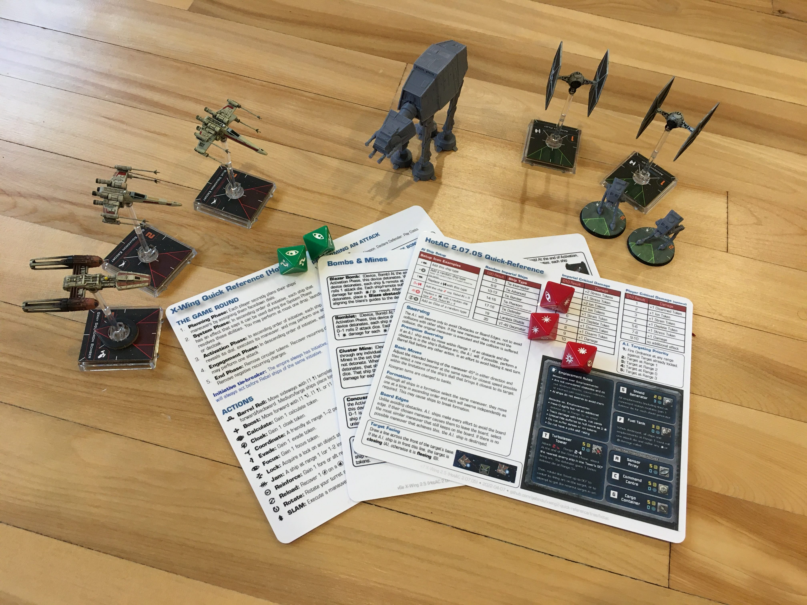

# X-Wing Heroes of the Aturi Cluster (2.07.05) Quick Reference Cards

This is a fork of the excellent [quick reference by Nicholas Piegdon](https://github.com/npiegdon/xwing2-quick-reference), originally for X-Wing 2.0, updated to X-Wing 2.5, and including a summary of all important game-specific rules to the [Heroes of the Aturi Cluster](https://drive.google.com/drive/folders/1vuEwgyzACV01iHs_k4dryoUbWlhCmNVY?fbclid=IwAR1crXrh9q47ywjW5ZM5OZXlKdg3qXeSTOaRZZEovdyjIPDcylPavx86MDk) cooperative campaign.

## Content

The document consists of 3 double-sided sheets, with the following content:

- A general X-Wing 2.5 rules summary, with two changes relevant to HotAC: the initiative and gas cloud rules (emphasized in blue).
- A summary of all major devices (bombs, mines, and remotes). (Many of these will never appear in a HotAC campaign, but were included for completeness sake.)
- A summary of HotAC specific rules, including rules for the extension Ground Assault.

It's recommended to print these sheets double-sided on cardstock and laminate them.  The first sheet could be printed several times, one for each player. The other two sheets probably suffice once.

## Version

All rules are following the [Atomic Mass Games Rules Reference 1.4.1](https://www.atomicmassgames.com/s/SWZ_RulesReference_v141web.pdf) (for the general X-Wing 2.5 rules), as well as the HotAC 2.07.05 release.

### Where's the PDF?

The pdf-file is directly included in the repository, next to the original Adobe Illustrator file.

## Credits

- **Nicholas Piegdon**, without whose work on the [original X-Wing reference](https://github.com/npiegdon/xwing2-quick-reference) this extended version would never have seen the light of day.
- **Josh Derksen**, **Shaun Tiernan**, and all other contributors to the fantastic Heroes of the Aturi Cluster campaign. For more information, see:
    - [The HotAC Facebook Group](https://www.facebook.com/groups/872507722883025)
    - [The HotAC 2.07.05 release (including Ground Assault)](https://drive.google.com/drive/folders/1vuEwgyzACV01iHs_k4dryoUbWlhCmNVY?fbclid=IwAR1crXrh9q47ywjW5ZM5OZXlKdg3qXeSTOaRZZEovdyjIPDcylPavx86MDk)
- [Doctor Nsara's quick reference](https://www.reddit.com/r/XWingTMG/comments/t37ozj/i_made_a_xwing_30_rules_quick_reference_sheet_for/), of which I borrowed the great bumping illustrations. 
- **Fantasy Flight Games** for nearly all of the front page, and, you know... for making the game in the first place.
- **[geordanr/xwing-miniatures-font](https://github.com/geordanr/xwing-miniatures-font)** for the great token symbol font.
- Everyone in **[r/XWingTMG](https://www.reddit.com/r/XWingTMG/)** for their feedback and suggestions! 
